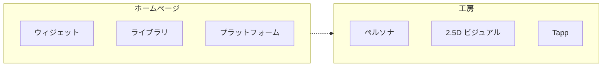
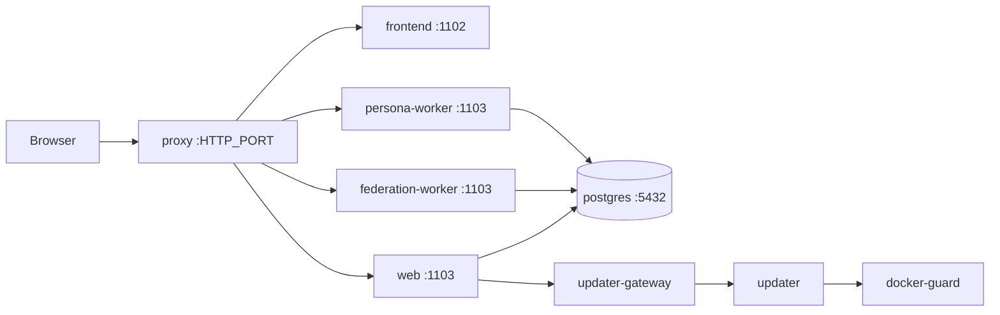

<div align="center">


# Myriad

### あなたという物語を、ひとつに

<em>A myriad of lights, in one place.</em>

<p>
<a href="README.md">English</a>
&nbsp;·&nbsp;
<a href="README.zh-CN.md">中文</a>
&nbsp;·&nbsp;
<strong>日本語</strong>
</p>

[](LICENSE)
[](https://github.com/myriad-you/Myriad/releases)
[](https://github.com/rust-lang/rust)
[](https://github.com/vitejs/vite)
[](https://github.com/facebook/react)

[クイックスタート](docs/QUICKSTART.md) · [ドキュメント](docs/INDEX.md) · [フィードバック](https://github.com/myriad-you/Myriad/issues)

[](https://discord.gg/Jr5HccgxyD)
[](https://x.com/myriadyou)
[](https://t.me/myriadyou)


</div>

---

## これは何か

**Myriad はセルフホストのホームページ兼創作工房です。** プラットフォームを集め、ライブラリを見せ、サイト全体でひとつのペルソナ、2.5D ビジュアル、所有する Tapp を動かします。

シングルテナント。公開または非公開。PostgreSQL。UI：`zh-CN` · `zh-TW` · `en-US` · `ja-JP` · `ko-KR` · `fr-FR` · `de-DE`。



<table>
<tr>
<td width="50%" valign="top">

### ホームページ
`/`

- 標準 16×4 · 自由 16×8
- 音楽、天気、Report Card、ペルソナウィジェット
- 自由レイアウトのステッカーはウィジェット枠を占有しない

</td>
<td width="50%" valign="top">

### ライブラリ
`/library`

- ゲーム、アニメ、映像、書籍、音楽
- 接続済みプラットフォームから同期
- リストまたは無限キャンバス

</td>
</tr>
<tr>
<td width="50%" valign="top">

### ペルソナ · 2.5D
サイト全体でひとつ

- レポートから生成、または文案 + 立ち絵を取り込む
- レイヤーライブ：呼吸、まばたき、口パク
- メイン立ち絵からステッカーアバター

</td>
<td width="50%" valign="top">

### Tapp
`/tapp`

- Page、ホームページ Widget、または両方
- ストア · Playground · CLI
- サンドボックス。秘密はホスト側

</td>
</tr>
</table>

<table>
<tr>
<td width="33%" valign="top">

**Agent**  
Chat / Work · パネル

</td>
<td width="33%" valign="top">

**Phantasi**（手帳）`/journal`
RSS · Notion · RSSHub

</td>
<td width="33%" valign="top">

**連合**  
ActivityPub · MFP

</td>
</tr>
</table>

`/config` は管理者のみ。ライブラリ、Phantasi、レポート、Tapp、Agent：全員 / ログイン済み / 管理者。

---

## 目次

**製品** — [ホームページ](#ホームページ) · [プラットフォーム](#プラットフォーム) · [ライブラリ](#ライブラリとレポート) · [ペルソナ](#ペルソナと-25d-ビジュアル) · [Tapp](#tapp) · [Agent](#agent) · [Phantasi](#phantasi) · [連合](#連合) · [アカウント](#アカウントと公開範囲)

**実行** — [要件](#要件) · [デプロイ](#デプロイ) · [開発](#ローカル開発) · [運用](#運用)

**参照** — [アーキテクチャ](#アーキテクチャ) · [リポジトリ](#リポジトリ) · [技術構成](#技術構成) · [ドキュメント](#ドキュメント) · [License](#license)

---

## ホームページ

**標準** 16×4（中央寄せ、狭幅では詰め直し）または **自由** 16×8（同セル）。座標はレイアウトごとに保存。自由レイアウトのステッカーはウィジェットではなく、ウィジェット枠を占有しない。

<details>
<summary>組み込みウィジェット</summary>

| | |
| --- | --- |
| 歓迎 | Agent ペルソナ（ライブ 2.5D。同時再生は一箇所） |
| 概要 · 最近の活動 · 訪問 | 天気 · 一言 · 音楽 |
| 相互リンク（Phantasi）· ソーシャル · Tapp ショートカット | miHoYo ゲーム Presence · プラットフォーム別 Report Card |

インストール済み Tapp はホームページ用ウィジェットを登録できる。

</details>

---

## プラットフォーム

<table>
<tr>
<td width="50%" valign="top">

**GitHub** — リポジトリ、Star、コントリビューション  
**Steam** — ライブラリ、ウィッシュリスト、プレイ統計  
**YouTube** — 公開チャンネル、最近の投稿  
**Discord** — プロフィール、サーバー、連携アカウント  
**MyAnimeList** — アニメ / マンガのリストと点数  
**PlayStation** — トロフィー、レベル、最近のゲーム

</td>
<td width="50%" valign="top">

**Bilibili** — お気に入り、アニメ、視聴履歴  
**網易雲** — 好きな曲と傾向  
**Bangumi** — コレクション、評価、視聴状態  
**X** — プロフィールと投稿  
**Xbox** — 実績、Gamerscore、最近のゲーム

</td>
</tr>
</table>

PostgreSQL に保存。Report Card、ライブラリ、レポートは同一データを読む。

---

## ライブラリとレポート

**ライブラリ**は接続済みプラットフォームのゲーム、アニメ、映像、書籍、音楽を種類で絞り込む。レイアウト：リストまたは無限キャンバス。低スペックはリストに戻る。カテゴリごとのソースは設定可能。

**レポート**は各サービスの肖像。案内つきペルソナ作成が読む。もう一方の経路は文案の貼り付けと立ち絵のアップロード。

---

## ペルソナと 2.5D ビジュアル

サイト全体でひとつの話し手と上半身 2.5D ビジュアル（**Agent ペルソナ**）。オン：Agent はそのペルソナとして話す。オフ：Chat と Work は残る。

```text
レポート → ペルソナ → 視覚設定 → メイン立ち絵 → レイヤー PSD
           または文案 + 立ち絵を取り込む
```

視覚設定は人物と衣装を分離。メイン立ち絵は 3:4、上半身。レイヤー PSD で呼吸、まばたき、口パク。

頭と胴は発話と歌唱に追随。着替えはライブプレーヤーを破棄しない。メイン立ち絵から **ステッカーアバター**（頭のみ）を派生でき、アバター枠と Agent 通知に使う。メイン立ち絵を替えると無効。

ライブの顔は同時に一箇所。ブラウザ内レイヤー 2.5D（[Anime2.5DRig](https://github.com/852wa/Anime2.5DRig)）。その再生で Myriad サーバーは GPU 推論しない。

---

## Tapp

**Page**、ホームページ **Widget**、または両方。サンドボックス。インストール時に権限を承認。ホスト秘密とアプリ認証情報はサンドボックスに入らず、エラー文にも出ない。

<table>
<tr>
<td width="33%" valign="top">

**ストア**  
[tapp-store](https://github.com/Myriad-You/tapp-store)  
`/tapp/store`

</td>
<td width="33%" valign="top">

**Playground**  
デスクトップ管理者  
`/tapp/playground`

自然言語で Page、Widget のみ、または両方。本番サンドボックスでプレビュー。インストールまたは `.tapp` 書き出し。モバイル非表示。

</td>
<td width="33%" valign="top">

**CLI**  
[`tapp-cli`](tools/tapp-cli/README.md)  
`myriad-tapp init / check / pack`

</td>
</tr>
</table>

Page：Canvas / WebGL、パッケージ内アセット、音声、任意のホスト注入 [Three.js](https://github.com/mrdoob/three.js)。Widget は重い 3D 向けではない。[Tapp 開発](docs/development/TAPP_DEVELOPMENT.md)。

---

## Agent

<table>
<tr>
<td width="50%" valign="top">

**Chat**

ペルソナオン時はそのペルソナとしてのみ話す。検索、予約、生成、計画なし。着替えと、現在のプレーヤーの再生 / 停止 / スキップは可。

</td>
<td width="50%" valign="top">

**Work**

計画、確認、実行。記憶、スキル、定期実行、MCP。範囲は付与された権限。

</td>
</tr>
</table>

気づいた事項を Work に渡す提案ができる。提案の受理は自律許可ではない。任意の TTS、聞き取り。音声 / リアルタイム会話を設定すれば長押しで連続会話。

ペルソナ、Bot ペアリング、ハートビートは `/agent/settings`。`/config` ではない。MCP サーバー一覧はまだ `/config` → 詳細設定。保存で `mcp_servers.json` を書き、子プロセスをホットリロードする。プライベートチャット Bot（QQ、Telegram、Discord、飛書）は同じ Work パイプラインに入る。ペアリングは新しいログイン方式ではない。[チャンネル](docs/development/AGENT_CHANNELS.md)。

---

## Phantasi

内部名。ユーザー向けの製品名は**手帳**（en: Journal）。RSS、Notion、RSSHub、任意の AI 強化。既定は誰でも閲覧可。ログインユーザーは既読を記録でき、スターとソース管理は管理者専用。管理者は `/journal/workbench` でソースを管理。相互リンクはホームページに出せる。

ボード：`/journal`（購読）、`/journal/notes`、`/journal/friends`。スター：`/journal/starred`。自身の記事：`/journal/articles/...`。ノート RSS（`/journal/notes.xml`）は管理者が有効化するまで非公開。ノートは TeX 数式、共同著者、本文カラム、本文ウィジェットに対応。クローラは HTML シェル、ブラウザはアプリ。

---

## 連合

ActivityPub + **MFP**。発見は `BASE_URL` を使う。

フォロー：Actor URL（`https://your.domain/users/<name>`）または `@name@your.domain`。チャンネルとリングに対応。WebFinger、NodeInfo、inbox、連合メディアは **proxy → federation-worker**。SPA にも web プロセスにも入らない。

出口地理位置が制限地域なら **連合ゲート** が連合を止める（照会失敗は fail-open）。専用連合プロセスは終了する。web と persona は動き続ける。

注記：[連合](docs/development/FEDERATION.md)。連合ドメインの移転 ≠ 通常のドメイン変更。

---

## アカウントと公開範囲

- **ローカルアカウント：** オーナー作成後。登録のオン/オフ。OAuth 連携後、そのユーザーのパスワードログインを無効化できる。
- **OAuth：** 組み込み GitHub と任意の OIDC（Authentik、Keycloak、Google、Microsoft、GitLab、Discord、…）。身元は明示バインド。二つの issuer の同一メールはマージしない。
- **モジュール公開範囲：** ライブラリ、Phantasi、レポート、Tapp、Agent — 全員 / ログイン済み / 管理者。
- **検索と AI：** 非公開（noindex、空 sitemap、`/llms.txt` なし）、検索エンジンのみ、AI 引用、完全公開。
- **サイト識別：** 名前、紹介、アイコン、任意 PWA、壁紙とテーマ、第一者訪問統計、任意の Google Analytics / Umami。

---

## 運用

本番：**proxy + updater**。ホスト公開は **proxy** のみ。web、`federation-worker`、`persona-worker`、frontend、Postgres、updater、updater-gateway、docker-guard は内部ネット。proxy は persona / federation / 残りの API を振り分ける。[PORTS.md](docs/deployment/PORTS.md)。

版切り替えとロールバック：`/config` → 情報 → 更新管理。ブラウザは `UPDATE_TOKEN` を受け取らない。`:latest` を上書きしない。

同梱 Postgres：updater は `./pgdata` をスナップショット。ロールバックはデータディレクトリとイメージ tag を戻す。外部 Postgres：`MYRIAD_DB_MODE=external`。ロールバックはイメージ tag のみ。[外部 PostgreSQL](docs/deployment/EXTERNAL_POSTGRES.md)。

約 1 GiB ホスト向けメモリ節約。`/config` の診断は実検査（データベース、ストレージ、版、出口、連合ゲート）。報告に認証情報は含まない。

---

## 要件

**本番（Docker）**

- Docker + Compose
- ホストポート（`HTTP_PORT`、既定 80）
- linux/amd64 または linux/arm64

**ソースから**

- Rust 1.98+
- Node.js 24 LTS
- PostgreSQL 18（Compose 既定。下限は release `min_pg_version`）

---

## デプロイ

### Docker

```bash
git clone https://github.com/myriad-you/Myriad.git
cd Myriad

cp .env.production.example .env
# 必須: POSTGRES_PASSWORD / JWT_SECRET / CORS_ORIGINS
# BASE_URL / FRONTEND_URL = 公開オリジン（連合の発見は BASE_URL）
# UPDATE_TOKEN / UPDATER_GATEWAY_SECRET / PERSONA_DB_PASSWORD /
# FEDERATION_DB_PASSWORD 空欄 → deploy.sh が生成

bash scripts/extra/deploy.sh up
```

`http://localhost`（または `HTTP_PORT`）を開き、ウィザードでデータベース、オーナー、サイト名を完了する。

公式 Compose は `DATABASE_URL` を設定済みのため、起動には `MYRIAD_SETUP_SECRET` が必要（`deploy.sh up` が生成）。ウィザードでデータベースを手入力する場合、この暗号は使わない。[Setup インストール暗号](docs/deployment/SETUP_BOOTSTRAP.md)。

```text
host HTTP_PORT → proxy → frontend:1102
                      → backend:1103 → postgres:5432
                      → federation-worker:1103
                      → persona-worker:1103
                      → updater（内部; updater-gateway 経由）
```

```bash
bash scripts/extra/deploy.sh status
bash scripts/extra/deploy.sh logs
bash scripts/extra/deploy.sh restart
bash scripts/extra/deploy.sh down
```

更新：`/config` → 情報 → 更新管理。手動 tag：`.env` の `MYRIAD_TAG` / `PROXY_TAG` のあと `bash scripts/extra/deploy.sh upgrade`。

同梱 Postgres のバックアップ：

```bash
mkdir -p backups
docker compose exec -T postgres pg_dump -U myriad -d myriad > "backups/backup_$(date +%Y%m%d_%H%M%S).sql"
```

[クイックスタート](docs/QUICKSTART.md) · [Docker](docs/deployment/DOCKER_DEPLOYMENT.md) · [ポート](docs/deployment/PORTS.md) · [Docker なし](docs/deployment/NATIVE_DEPLOYMENT.md)

---

## ローカル開発

```bash
./scripts/dev.sh                   # TUI：メニュー、プロセス、データベース、ログ
./scripts/dev.sh start             # 本機 PostgreSQL。ログはこの端末
./scripts/dev.sh start --docker    # Docker postgres + 新しい端末
./scripts/dev.sh doctor            # ツールチェーン、ポート、データベース
./scripts/dev.sh status            # スナップショット
.\scripts\dev.ps1 start            # Windows
```

バックエンド `:1103`、フロントエンド `:1102`。本機データベースがなければ `./scripts/dev.sh db-setup`。

フロントの dev server は `/api/*`、`/health`、`/ready`、連合の公開パスをバックエンドへプロキシする。

開発 UI の更新管理：`./scripts/dev.sh start all-updater`。イメージ差し替え、メンテナンスモード、`pgdata` スナップショットは本番スタック（`scripts/extra/deploy.sh`）。

---

## アーキテクチャ



<details>
<summary>開発 / 本番トポロジ</summary>

**開発**

```text
browser → Vite dev (:1102)
            └─ /api/*, /health, /ready, federation public paths → backend (:1103) → postgres
```

**本番**

```text
host HTTP_PORT
  → proxy
       ├─► frontend (:1102)                 [myriad-net]
       ├─► backend (:1103) → postgres         MYRIAD_PROCESS_ROLE=web
       ├─► federation-worker (:1103)
       ├─► persona-worker (:1103)
       │
       └─► backend ─► updater-gateway → updater   [myriad-admin-net]
                                          └─► docker-guard → Docker sock
       (rescue) updater when PROXY_ALLOW_DIRECT_UPDATER=true
```

図は内蔵 PostgreSQL の構成で、両 worker も同じデータベースへ直接接続します。外部 DB コンテナを使う場合は、backend と両 worker を DB と同じ `MYRIAD_BACKEND_EXTRA_NETWORK`（既定 `myriad-backend-ext`）に接続します。Updater/Guard はこの 3 サービスに限り同ネットワークを許可します。旧版は固定の既定名しか認識しないため、両方を先にアップグレードしてからサイト内更新を利用してください。[外部 PostgreSQL](docs/deployment/EXTERNAL_POSTGRES.md) を参照。

</details>

クローラ / アプリ内シェア UA はホーム、ライブラリ、Phantasi、レポート、Tapp の SEO HTML シェルを受け取り、ブラウザは SPA を受け取る。[アーキテクチャ](docs/development/ARCHITECTURE.md)。

---

## リポジトリ

```
Myriad/
├── backend/          Rust API、SeaORM、migrations
├── frontend/         Vite + React UI、Tapp ランタイム、i18n（宿主 locale 7 種）
├── proxy/            本番リバースプロキシ（独立 Cargo ツリー）
├── updater/          自己更新デーモン（独立 Cargo ツリー）
├── crates/           ワークスペースライブラリ
├── shared/           横断静的設定
├── docker/           backend / frontend Dockerfile
├── docs/             開発、デプロイ、機能（中国語）
├── scripts/          dev.sh / dev.ps1；extra/ デプロイ
├── release/          release.json 契約
├── tools/            tapp-cli、契約エクスポート
└── docker-compose*.yml
```

`proxy` と `updater` は独立 Cargo ツリー。

---

## 技術構成

<table>
<tr>
<td width="50%" valign="top">

**フロントエンド**  
[Vite](https://github.com/vitejs/vite) 8 · [React](https://github.com/facebook/react) 19 · [React Router](https://github.com/remix-run/react-router) 7<br>
[Tailwind](https://github.com/tailwindlabs/tailwindcss) 4 · [Vite](https://github.com/vitejs/vite) 8 · [TypeScript](https://github.com/microsoft/TypeScript) 6 · [Motion](https://github.com/motiondivision/motion) · [pnpm](https://github.com/pnpm/pnpm)  
`zh-CN` · `zh-TW` · `en-US` · `ja-JP` · `ko-KR` · `fr-FR` · `de-DE`

**ライブ顔**  
[Anime2.5DRig](https://github.com/852wa/Anime2.5DRig) · WebGL2

**音声**  
Agora RTC / RTM（任意）

</td>
<td width="50%" valign="top">

**バックエンド**  
[Rust](https://github.com/rust-lang/rust) 1.98 · [Axum](https://github.com/tokio-rs/axum) 0.8 · [Tokio](https://github.com/tokio-rs/tokio)  
[SeaORM](https://github.com/SeaQL/sea-orm) 2 / [SQLx](https://github.com/launchbadge/sqlx) · [reqwest](https://github.com/seanmonstar/reqwest) 0.13

**データ**  
[PostgreSQL](https://github.com/postgres/postgres) 18

**エッジ**  
proxy · updater

**拡張**  
Tapp サンドボックス · [MCP](https://github.com/modelcontextprotocol/modelcontextprotocol) · ActivityPub / MFP

**デプロイ**  
[Docker Compose](https://github.com/docker/compose) · linux/amd64 + arm64

</td>
</tr>
</table>

---

## ドキュメント

現在は中国語。[入口](docs/INDEX.md)。

<table>
<tr>
<td width="33%" valign="top">

**始める**  
[クイックスタート](docs/QUICKSTART.md)  
[アーキテクチャ](docs/development/ARCHITECTURE.md)  
[ビルド](docs/development/BUILD.md)  
[API](docs/API.md)

</td>
<td width="33%" valign="top">

**製品**  
[Tapp](docs/development/TAPP_DEVELOPMENT.md)  
[ライブラリ](docs/features/LIBRARY.md)  
[OAuth](docs/development/OAUTH.md)  
[連合](docs/development/FEDERATION.md)  
[Agent チャンネル](docs/development/AGENT_CHANNELS.md)

</td>
<td width="33%" valign="top">

**デプロイ**  
[Docker](docs/deployment/DOCKER_DEPLOYMENT.md)  
[ポート](docs/deployment/PORTS.md)  
[隔離](docs/deployment/RUNTIME_ISOLATION.md)  
[Worker DB](docs/deployment/WORKER_DATABASE.md)  
[バックアップ](docs/deployment/BACKUP.md)  
[Updater](docs/deployment/UPDATER_QUICKSTART.md)  
[外部 PG](docs/deployment/EXTERNAL_POSTGRES.md)  
[Docker なし](docs/deployment/NATIVE_DEPLOYMENT.md)  
[Setup インストール暗号](docs/deployment/SETUP_BOOTSTRAP.md)

</td>
</tr>
</table>

---

## スポンサー

Myriad はオープンに開発され、使ってくれる人たちに支えられています。役に立っていると感じたら、ぜひ応援をお願いします：

[](https://app.unifans.io/c/somekawahitomi)
[](https://liberapay.com/furina/donate)
[](https://afdian.com/a/mamori)

支えてくださるすべての方に感謝します。

## 貢献

Issue と PR を歓迎。UI 文言：`zh-CN` / `zh-TW` / `en-US` / `ja-JP` / `ko-KR` / `fr-FR` / `de-DE`。

### コントリビューター

[](https://github.com/Myriad-You/Myriad/graphs/contributors)

### AI エージェント

Myriad のコードの多くはコーディングエージェントと一緒に書かれています。それらのコミットには `Co-Authored-By` が付くため、GitHub のコントリビューター一覧にも表示されます。

[](https://claude.com/claude-code)
[](https://cursor.com)
[](https://github.com/features/copilot)

## License

ホスト（`backend` / `frontend` およびワークスペース crate）と `proxy` / `updater` は [AGPL-3.0](LICENSE) です。文書化された Bridge だけを通してホストと話す Tapp は独立した著作物であり、そのライセンスは作者が決めます（`LICENSE` の AGPL 第 7 条追加許可を参照）。

Tapp の契約とツール（`crates/tapp-contract`、`tools/tapp-cli`、`tools/tapp-contract-export`）は [Apache-2.0](LICENSES/Apache-2.0.txt) です。

2.5D 再生：[Anime2.5DRig](https://github.com/852wa/Anime2.5DRig)（MIT）。

<br/>

<div align="center">
<sub><i>あなたという物語を、ひとつに</i> · <i>A myriad of lights, in one place.</i></sub>
<br/>
<sub><a href="README.md">English</a> · <a href="README.zh-CN.md">中文</a> · <strong>日本語</strong></sub>
<br/>
<sub>Maintained by <a href="https://github.com/myriad-you">@myriad-you</a></sub>
</div>
