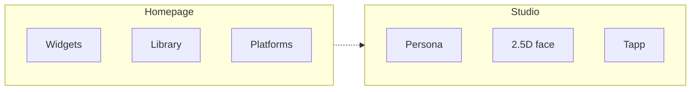
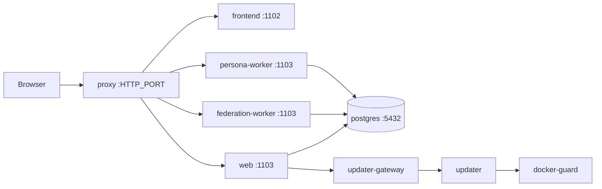

<div align="center">


# Myriad

<em>A myriad of lights, in one place.</em>

<p>
<strong>English</strong>
&nbsp;·&nbsp;
<a href="README.zh-CN.md">中文</a>
&nbsp;·&nbsp;
<a href="README.ja.md">日本語</a>
</p>

[](LICENSE)
[](https://github.com/myriad-you/Myriad/releases)
[](https://github.com/rust-lang/rust)
[](https://github.com/vitejs/vite)
[](https://github.com/facebook/react)

[Quick start](docs/QUICKSTART.md) · [Docs](docs/INDEX.md) · [Issues](https://github.com/myriad-you/Myriad/issues)

[](https://discord.gg/Jr5HccgxyD)
[](https://x.com/myriadyou)
[](https://t.me/myriadyou)


</div>

---

## What it is

**Myriad is a self-hosted homepage and creative studio.** Aggregate your platforms, show a library, and run a site-wide persona, a 2.5D face, and Tapp apps you own.

Single-tenant. Public or private. PostgreSQL. UI: `zh-CN` · `zh-TW` · `en-US` · `ja-JP` · `ko-KR` · `fr-FR` · `de-DE`.



<table>
<tr>
<td width="50%" valign="top">

### Homepage
`/`

- Standard 16×4 · free 16×8
- Music, weather, report cards, persona widget
- Stickers on free layout — not widget cells

</td>
<td width="50%" valign="top">

### Library
`/library`

- Games, anime, shows, books, music
- Synced from connected platforms
- List or infinite canvas

</td>
</tr>
<tr>
<td width="50%" valign="top">

### Persona · 2.5D
site-wide

- From reports, or import a write-up + portrait
- Layered live face: breath, blink, lip-sync
- Sticker avatar from the master portrait

</td>
<td width="50%" valign="top">

### Tapp
`/tapp`

- Page, homepage Widget, or both
- Store · Playground · CLI
- Sandbox; host secrets never enter

</td>
</tr>
</table>

<table>
<tr>
<td width="33%" valign="top">

**Agent**  
Chat / Work · panel

</td>
<td width="33%" valign="top">

**Phantasi** (Journal) `/journal`  
RSS · Notion · RSSHub

</td>
<td width="33%" valign="top">

**Federation**  
ActivityPub · MFP

</td>
</tr>
</table>

`/config` is admin-only. Library, Phantasi, Reports, Tapp, Agent: everyone / signed-in / admins.

---

## Contents

**Product** — [Homepage](#homepage) · [Platforms](#platforms) · [Library](#library-and-reports) · [Persona](#persona-and-25d-face) · [Tapp](#tapp) · [Agent](#agent) · [Phantasi](#phantasi) · [Federation](#federation) · [Accounts](#accounts-and-visibility)

**Run** — [Requirements](#requirements) · [Deploy](#deploy) · [Dev](#local-development) · [Operations](#operations)

**Reference** — [Architecture](#architecture) · [Repository](#repository) · [Stack](#stack) · [Docs](#docs) · [License](#license)

---

## Homepage

**Standard** 16×4 (centered, compact on narrow screens) or **free** 16×8 (same cell size). Coordinates stored per layout. Free layout stickers are not widgets and do not occupy widget cells.

<details>
<summary>Built-in widgets</summary>

| | |
| --- | --- |
| Welcome | Agent persona (live 2.5D; one playback at a time) |
| Quick stats · recent activity · visitors | Weather · daily quote · music |
| Friend links (Phantasi) · social · Tapp shortcuts | miHoYo game presence · per-platform report cards |

Installed Tapps may register homepage widgets.

</details>

---

## Platforms

<table>
<tr>
<td width="50%" valign="top">

**GitHub** — repos, stars, contributions  
**Steam** — library, wishlist, play stats  
**YouTube** — public channel stats, recent uploads  
**Discord** — profile, servers, linked accounts  
**MyAnimeList** — anime / manga lists and scores  
**PlayStation** — trophies, trophy level, recent games

</td>
<td width="50%" valign="top">

**Bilibili** — favorites, anime, viewing history  
**NetEase Cloud Music** — liked songs and taste  
**Bangumi** — collections, ratings, watching status  
**X** — profile and posts  
**Xbox** — achievements, Gamerscore, recent games

</td>
</tr>
</table>

Stored in PostgreSQL. Report cards, Library, and Reports read the same data.

---

## Library and reports

**Library** lists games, anime, shows, books, and music from connected platforms, filtered by type. Layout: list or infinite canvas; low-end devices fall back to the list. Per-category sources are configurable.

**Reports** are per-platform portraits. Guided persona setup reads them. A write-up plus an uploaded portrait is the other path.

---

## Persona and 2.5D face

One site-wide speaking personality and one upper-body 2.5D face (**Agent persona**). On: Agent speaks as that persona. Off: Agent still provides Chat and Work.

```text
reports → persona → visual profile → master portrait → layered PSD
          or import write-up + portrait
```

Visual profile stores person and outfit separately. Master portrait is 3:4, upper body. A layered PSD enables live breath, blink, and lip-sync.

Head and torso follow speech and song. Outfit changes keep the live player. A **sticker avatar** (head only) can be derived for profile slots and Agent notifications; replacing the master portrait invalidates it.

One live face at a time. Browser 2.5D ([Anime2.5DRig](https://github.com/852wa/Anime2.5DRig)). The Myriad server does not GPU-infer that playback.

---

## Tapp

**Page**, homepage **Widget**, or both. Sandboxed. Permissions approved at install. Host secrets and app credentials never enter the sandbox, including error payloads.

<table>
<tr>
<td width="33%" valign="top">

**Store**  
[tapp-store](https://github.com/Myriad-You/tapp-store)  
`/tapp/store`

</td>
<td width="33%" valign="top">

**Playground**  
desktop admin  
`/tapp/playground`

Natural-language Page, Widget-only, or both. Preview in the production sandbox; install or export `.tapp`. Hidden on mobile.

</td>
<td width="33%" valign="top">

**CLI**  
[`tapp-cli`](tools/tapp-cli/README.md)  
`myriad-tapp init / check / pack`

</td>
</tr>
</table>

Page: Canvas / WebGL, pack-local assets, audio, optional host-injected [Three.js](https://github.com/mrdoob/three.js). Widgets are not for heavy 3D. [Tapp development](docs/development/TAPP_DEVELOPMENT.md).

---

## Agent

<table>
<tr>
<td width="50%" valign="top">

**Chat**

Persona on: speaks only as that persona. No search, booking, generation, or planning. Outfit change and current-player play / pause / skip are allowed.

</td>
<td width="50%" valign="top">

**Work**

Plan, confirm, execute. Memory, skills, scheduled jobs, MCP. Scope is granted permissions.

</td>
</tr>
</table>

May propose handing a noticed item to Work; accepting is not autonomy. Optional TTS, listening, and long-press live conversation when speech / realtime talk is configured.

Owner persona, Bot pairing, and heartbeat live at `/agent/settings` — not `/config`. MCP server list is still `/config` → Advanced; save writes `mcp_servers.json` and hot-reloads children. Private-chat Bots (QQ, Telegram, Discord, 飞书) enter the same Work pipeline; pairing is not a new login. [Channels](docs/development/AGENT_CHANNELS.md).

---

## Phantasi

Internal name for the Journal (zh: 手帐, ja/zh-TW: 手帳, ko: 수첩). RSS, Notion, RSSHub, optional AI enrichment. Default: anyone can read. Signed-in users mark read; starred items and source management are admin-only. Admins manage sources from `/journal/workbench`. Friend links can appear on the homepage.

Boards: `/journal` (feeds), `/journal/notes`, `/journal/friends`. Starred: `/journal/starred`. Own articles: `/journal/articles/...`. Notes RSS (`/journal/notes.xml`) is off until an admin enables it. Notes support TeX math, co-authors, columns, and in-body widgets. Crawlers receive an HTML shell; browsers receive the app.

---

## Federation

ActivityPub + **MFP**. Discovery uses `BASE_URL`.

Follow via Actor URL (`https://your.domain/users/<name>`) or `@name@your.domain`. Channels and rings are supported. WebFinger, NodeInfo, inboxes, and federation media: **proxy → federation-worker**, not the SPA or the web process.

A geographic **federation gate** can disable federation when the server's egress location is a blocked region (fail-open if the lookup fails). The dedicated federation process then exits; web and persona keep running.

Notes: [Federation](docs/development/FEDERATION.md). Federated domain move ≠ ordinary domain change.

---

## Accounts and visibility

- **Local accounts** after owner creation. Registration on/off. Per-user password login can be disabled after OAuth is linked.
- **OAuth:** built-in GitHub plus arbitrary OIDC (Authentik, Keycloak, Google, Microsoft, GitLab, Discord, …). Identities bind explicitly; the same email on two issuers is not merged.
- **Module visibility:** Library, Phantasi, Reports, Tapp, Agent — everyone / signed-in / admins.
- **Search & AI:** private (noindex, empty sitemap, no `/llms.txt`), search engines only, AI citations, or fully open.
- **Site identity:** name, blurb, icon, optional PWA, wallpaper and theme, first-party visitor stats, optional Google Analytics / Umami.

---

## Operations

Production: **proxy + updater**. Only **proxy** publishes a host port. Web, `federation-worker`, `persona-worker`, frontend, Postgres, updater, updater-gateway, and docker-guard stay on internal networks. Proxy splits persona / federation / remaining API; see [PORTS.md](docs/deployment/PORTS.md).

Version switch and rollback: `/config` → About → Update management. The browser never receives `UPDATE_TOKEN`. Do not overwrite `:latest`.

Bundled Postgres: updater snapshots `./pgdata`; rollback restores data directory and image tags. External Postgres: `MYRIAD_DB_MODE=external`; rollback restores image tags only. [External PostgreSQL](docs/deployment/EXTERNAL_POSTGRES.md).

Memory-saver profile for ~1 GiB hosts. `/config` diagnostics run live checks (database, storage, version, egress, federation gate) and emit a credential-free report.

---

## Requirements

**Production (Docker)**

- Docker + Compose
- Host port (`HTTP_PORT`, default 80)
- linux/amd64 or linux/arm64

**From source**

- Rust 1.98+
- Node.js 24 LTS
- PostgreSQL 18 (Compose default; floor: release `min_pg_version`)

---

## Deploy

### Docker

```bash
git clone https://github.com/myriad-you/Myriad.git
cd Myriad

cp .env.production.example .env
# Required: POSTGRES_PASSWORD / JWT_SECRET / CORS_ORIGINS
# BASE_URL / FRONTEND_URL = public origin (federation discovery uses BASE_URL)
# Empty UPDATE_TOKEN / UPDATER_GATEWAY_SECRET / PERSONA_DB_PASSWORD /
# FEDERATION_DB_PASSWORD → generated by deploy.sh

bash scripts/extra/deploy.sh up
```

Open `http://localhost` (or `HTTP_PORT`) and complete the wizard: database, owner, site name.

Official Compose sets `DATABASE_URL`, so startup requires `MYRIAD_SETUP_SECRET` (`deploy.sh up` generates it). Wizard-entered databases do not use that secret. [Setup secret](docs/deployment/SETUP_BOOTSTRAP.md).

```text
host HTTP_PORT → proxy → frontend:1102
                      → backend:1103 → postgres:5432
                      → federation-worker:1103
                      → persona-worker:1103
                      → updater (internal; via updater-gateway)
```

```bash
bash scripts/extra/deploy.sh status
bash scripts/extra/deploy.sh logs
bash scripts/extra/deploy.sh restart
bash scripts/extra/deploy.sh down
```

Updates: `/config` → About → Update management. Manual tag bump: `MYRIAD_TAG` / `PROXY_TAG` in `.env`, then `bash scripts/extra/deploy.sh upgrade`.

Bundled Postgres backup:

```bash
mkdir -p backups
docker compose exec -T postgres pg_dump -U myriad -d myriad > "backups/backup_$(date +%Y%m%d_%H%M%S).sql"
```

[Quick start](docs/QUICKSTART.md) · [Docker](docs/deployment/DOCKER_DEPLOYMENT.md) · [Ports](docs/deployment/PORTS.md) · [Native](docs/deployment/NATIVE_DEPLOYMENT.md)

---

## Local development

```bash
./scripts/dev.sh                   # TUI: menu, processes, database, logs
./scripts/dev.sh start             # local PostgreSQL; logs in this terminal
./scripts/dev.sh start --docker    # Docker postgres + new terminal
./scripts/dev.sh doctor            # toolchain, ports, database
./scripts/dev.sh status            # snapshot
.\scripts\dev.ps1 start            # Windows
```

Backend `:1103`, frontend `:1102`. Without a local database: `./scripts/dev.sh db-setup`.

The frontend dev server proxies `/api/*`, `/health`, `/ready`, and public federation paths to the backend.

Update management in the dev UI: `./scripts/dev.sh start all-updater`. Image replace, maintenance mode, and `pgdata` snapshots: production stack (`scripts/extra/deploy.sh`).

---

## Architecture



<details>
<summary>Development / production topology</summary>

**Development**

```text
browser → Vite dev (:1102)
            └─ /api/*, /health, /ready, federation public paths → backend (:1103) → postgres
```

**Production**

```text
host HTTP_PORT
  → proxy
       ├─► frontend (:1102)                 [myriad-net]
       ├─► backend (:1103) → postgres         MYRIAD_PROCESS_ROLE=web
       ├─► federation-worker (:1103)
       ├─► persona-worker (:1103)
       │
       └─► backend ─► updater-gateway → updater   [myriad-admin-net]
                                          └─► docker-guard → Docker sock
       (rescue) updater when PROXY_ALLOW_DIRECT_UPDATER=true
```

The diagram shows bundled PostgreSQL; both workers also connect directly to it.
For an external DB container, backend and both workers share
`MYRIAD_BACKEND_EXTRA_NETWORK` (default `myriad-backend-ext`) with it.
Updater/Guard permit this network only for those three services;
upgrade both before using online updates with this topology. See
[external PostgreSQL](docs/deployment/EXTERNAL_POSTGRES.md).

</details>

Crawler / in-app-share user-agents receive an SEO HTML shell for Home, Library, Phantasi, Reports, and Tapp; browsers receive the SPA. [Architecture](docs/development/ARCHITECTURE.md).

---

## Repository

```
Myriad/
├── backend/          Rust API, SeaORM, migrations
├── frontend/         Vite + React UI, Tapp runtime, i18n (7 host locales)
├── proxy/            production reverse proxy (own Cargo tree)
├── updater/          self-update daemon (own Cargo tree)
├── crates/           workspace libraries
├── shared/           cross-component static config
├── docker/           backend / frontend Dockerfiles
├── docs/             development, deploy, features (Chinese)
├── scripts/          dev.sh / dev.ps1; extra/ deploy
├── release/          release.json contract
├── tools/            tapp-cli, contract export
└── docker-compose*.yml
```

`proxy` and `updater` are independent Cargo trees.

---

## Stack

<table>
<tr>
<td width="50%" valign="top">

**Frontend**  
[Vite](https://github.com/vitejs/vite) 8 · [React](https://github.com/facebook/react) 19 · [React Router](https://github.com/remix-run/react-router) 7<br>
[Tailwind](https://github.com/tailwindlabs/tailwindcss) 4 · [Vite](https://github.com/vitejs/vite) 8 · [TypeScript](https://github.com/microsoft/TypeScript) 6 · [Motion](https://github.com/motiondivision/motion) · [pnpm](https://github.com/pnpm/pnpm)  
`zh-CN` · `zh-TW` · `en-US` · `ja-JP` · `ko-KR` · `fr-FR` · `de-DE`

**Live face**  
[Anime2.5DRig](https://github.com/852wa/Anime2.5DRig) · WebGL2

**Voice**  
Agora RTC / RTM (optional)

</td>
<td width="50%" valign="top">

**Backend**  
[Rust](https://github.com/rust-lang/rust) 1.98 · [Axum](https://github.com/tokio-rs/axum) 0.8 · [Tokio](https://github.com/tokio-rs/tokio)  
[SeaORM](https://github.com/SeaQL/sea-orm) 2 / [SQLx](https://github.com/launchbadge/sqlx) · [reqwest](https://github.com/seanmonstar/reqwest) 0.13

**Data**  
[PostgreSQL](https://github.com/postgres/postgres) 18

**Edge**  
proxy · updater

**Apps**  
Tapp sandbox · [MCP](https://github.com/modelcontextprotocol/modelcontextprotocol) · ActivityPub / MFP

**Deploy**  
[Docker Compose](https://github.com/docker/compose) · linux/amd64 + arm64

</td>
</tr>
</table>

---

## Docs

Currently Chinese. [Index](docs/INDEX.md).

<table>
<tr>
<td width="33%" valign="top">

**Start**  
[Quick start](docs/QUICKSTART.md)  
[Architecture](docs/development/ARCHITECTURE.md)  
[Build](docs/development/BUILD.md)  
[API](docs/API.md)

</td>
<td width="33%" valign="top">

**Product**  
[Tapp](docs/development/TAPP_DEVELOPMENT.md)  
[Library](docs/features/LIBRARY.md)  
[OAuth](docs/development/OAUTH.md)  
[Federation](docs/development/FEDERATION.md)  
[Agent channels](docs/development/AGENT_CHANNELS.md)

</td>
<td width="33%" valign="top">

**Deploy**  
[Docker](docs/deployment/DOCKER_DEPLOYMENT.md)  
[Ports](docs/deployment/PORTS.md)  
[Isolation](docs/deployment/RUNTIME_ISOLATION.md)  
[Worker DB](docs/deployment/WORKER_DATABASE.md)  
[Backup](docs/deployment/BACKUP.md)  
[Updater](docs/deployment/UPDATER_QUICKSTART.md)  
[External PG](docs/deployment/EXTERNAL_POSTGRES.md)  
[Native](docs/deployment/NATIVE_DEPLOYMENT.md)  
[Setup secret](docs/deployment/SETUP_BOOTSTRAP.md)

</td>
</tr>
</table>

---

## Sponsor

Myriad is built in the open and kept alive by the people who use it. If it has earned a place in your life, you can help keep it going:

[](https://liberapay.com/furina/donate)
[](https://app.unifans.io/c/somekawahitomi)
[](https://afdian.com/a/mamori)

Thank you to everyone who supports us.

## Contributing

Issues and PRs welcome. UI copy: `zh-CN` / `zh-TW` / `en-US` / `ja-JP` / `ko-KR` / `fr-FR` / `de-DE`.

## License

The host (`backend`, `frontend`, and workspace crates) and `proxy` / `updater` are [AGPL-3.0](LICENSE). A Tapp that talks to the host only through the documented Bridge is an independent work; its license is the author's (see the AGPL section 7 additional permission in `LICENSE`).

The Tapp contract and tooling (`crates/tapp-contract`, `tools/tapp-cli`, `tools/tapp-contract-export`) are [Apache-2.0](LICENSES/Apache-2.0.txt).

2.5D playback: [Anime2.5DRig](https://github.com/852wa/Anime2.5DRig) (MIT).

<br/>

<div align="center">
<sub><i>A myriad of lights, in one place.</i></sub>
<br/>
<sub><strong>English</strong> · <a href="README.zh-CN.md">中文</a> · <a href="README.ja.md">日本語</a></sub>
<br/>
<sub>Maintained by <a href="https://github.com/myriad-you">@myriad-you</a></sub>
</div>
