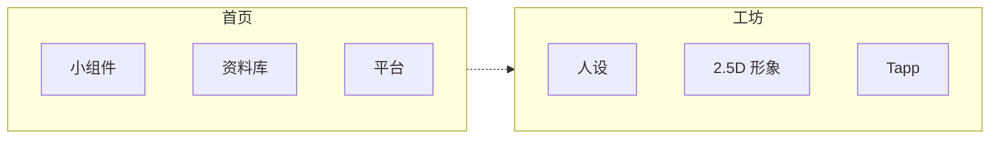
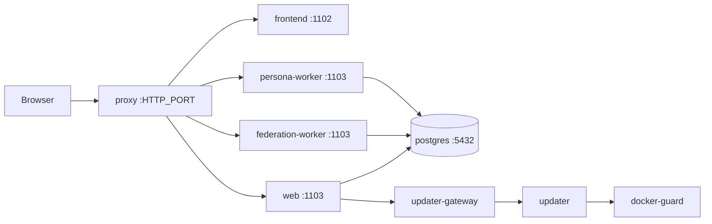

<div align="center">


# Myriad

### 让每一个你，被看见

<em>A myriad of lights, in one place.</em>

<p>
<a href="README.md">English</a>
&nbsp;·&nbsp;
<strong>中文</strong>
&nbsp;·&nbsp;
<a href="README.ja.md">日本語</a>
</p>

[](LICENSE)
[](https://github.com/myriad-you/Myriad/releases)
[](https://github.com/rust-lang/rust)
[](https://github.com/vitejs/vite)
[](https://github.com/facebook/react)

[快速开始](docs/QUICKSTART.md) · [文档](docs/INDEX.md) · [反馈](https://github.com/myriad-you/Myriad/issues)

[](https://discord.gg/Jr5HccgxyD)
[](https://x.com/myriadyou)
[](https://t.me/myriadyou)


</div>

---

## 它是什么

**Myriad 是自托管的个人主页与创作工坊。** 聚合各平台、展示资料库，并运行全站一份人设、2.5D 形象，以及你拥有的 Tapp 应用。

单租户。可公开或私有。PostgreSQL。界面：`zh-CN` · `zh-TW` · `en-US` · `ja-JP` · `ko-KR` · `fr-FR` · `de-DE`。



<table>
<tr>
<td width="50%" valign="top">

### 首页
`/`

- 标准 16×4 · 自由 16×8
- 音乐、天气、Report Card、人设小组件
- 自由布局贴纸不占小组件格

</td>
<td width="50%" valign="top">

### 资料库
`/library`

- 游戏、番剧、影视、书籍、音乐
- 从已连接平台同步
- 列表或无限画布

</td>
</tr>
<tr>
<td width="50%" valign="top">

### 人设 · 2.5D
全站一份

- 从报告生成，或导入文案 + 立绘
- 分层现场：呼吸、眨眼、口型
- 主立绘派生贴纸头像

</td>
<td width="50%" valign="top">

### Tapp
`/tapp`

- Page、首页 Widget，或两者
- 商店 · Playground · CLI
- 沙箱；密钥不进沙箱

</td>
</tr>
</table>

<table>
<tr>
<td width="33%" valign="top">

**Agent**  
Chat / Work · 面板

</td>
<td width="33%" valign="top">

**Phantasi**（手帐）`/journal`  
RSS · Notion · RSSHub

</td>
<td width="33%" valign="top">

**联邦**  
ActivityPub · MFP

</td>
</tr>
</table>

`/config` 仅管理员。资料库、Phantasi、报告、Tapp、Agent：所有人 / 登录用户 / 管理员。

---

## 目录

**产品** — [首页](#首页) · [平台](#平台) · [资料库](#资料库与报告) · [人设](#人设与-25d-形象) · [Tapp](#tapp) · [Agent](#agent) · [Phantasi](#phantasi) · [联邦](#联邦) · [账号](#账号与可见性)

**运行** — [运行要求](#运行要求) · [部署](#部署) · [开发](#本地开发) · [运维](#运维)

**参考** — [架构](#架构) · [仓库](#仓库) · [技术构成](#技术构成) · [文档](#文档) · [License](#license)

---

## 首页

**标准** 16×4（居中，窄屏紧凑重排）或 **自由** 16×8（同格尺寸）。坐标分布局存储。自由布局贴纸不是小组件，不占小组件格。

<details>
<summary>内置小组件</summary>

| | |
| --- | --- |
| 欢迎语 | Agent 人设（现场 2.5D；同时只播一份） |
| 内容概览 · 最近活动 · 访客 | 天气 · 一言 · 音乐 |
| 友情链接（Phantasi）· 社交 · Tapp 快捷方式 | 米哈游游戏 Presence · 各平台 Report Card |

已安装的 Tapp 可注册首页小组件。

</details>

---

## 平台

<table>
<tr>
<td width="50%" valign="top">

**GitHub** — 仓库、Star、贡献  
**Steam** — 游戏库、愿望单、游玩统计  
**YouTube** — 公开频道数据、最近上传  
**Discord** — 画像、服务器、绑定账号  
**MyAnimeList** — 动画 / 漫画列表与评分  
**PlayStation** — 奖杯、奖杯等级、最近游戏

</td>
<td width="50%" valign="top">

**Bilibili** — 收藏、追番、观看历史  
**网易云** — 喜欢的歌与品味  
**Bangumi** — 收藏、评分、追看状态  
**X** — 资料与帖子  
**Xbox** — 成就、Gamerscore、最近游戏

</td>
</tr>
</table>

写入 PostgreSQL。Report Card、资料库、平台报告读同一份数据。

---

## 资料库与报告

**资料库**按类型筛选已连接平台的游戏、番剧、影视、书籍、音乐。布局：列表或无限画布；低端设备回退列表。每类来源可配置。

**平台报告**为各平台画像。引导式人设会读取。另一条路径是贴文案并上传立绘。

---

## 人设与 2.5D 形象

全站一份说话人格与上半身 2.5D 形象（**Agent 人设**）。开：Agent 用人设说话。关：仍提供 Chat 与 Work。

```text
报告 → 人设 → 视觉设定 → 主立绘 → 分层 PSD
       或导入文案 + 立绘
```

视觉设定分人模块与衣服模块。主立绘 3:4、上半身。分层 PSD 用于呼吸、眨眼、口型。

头身跟随说话与唱歌。换装不卸载现场播放器。主立绘可派生 **贴纸头像**（仅头），用于头像位与 Agent 通知；更换主立绘后失效。

现场形象同时只播一份。浏览器分层 2.5D（[Anime2.5DRig](https://github.com/852wa/Anime2.5DRig)）。该播放不在 Myriad 服务器上做 GPU 推理。

---

## Tapp

**Page**、首页 **Widget**，或两者。沙箱运行。安装时批准权限。宿主密钥与应用凭据不进入沙箱，错误载荷中也不出现。

<table>
<tr>
<td width="33%" valign="top">

**商店**  
[tapp-store](https://github.com/Myriad-You/tapp-store)  
`/tapp/store`

</td>
<td width="33%" valign="top">

**Playground**  
桌面管理员  
`/tapp/playground`

自然语言 Page、仅 Widget 或两者。生产沙箱预览；安装或导出 `.tapp`。移动端不展示。

</td>
<td width="33%" valign="top">

**CLI**  
[`tapp-cli`](tools/tapp-cli/README.md)  
`myriad-tapp init / check / pack`

</td>
</tr>
</table>

Page：Canvas / WebGL、包内资源、音频、可选宿主注入的 [Three.js](https://github.com/mrdoob/three.js)。Widget 不承担重 3D。[Tapp 开发](docs/development/TAPP_DEVELOPMENT.md)。

---

## Agent

<table>
<tr>
<td width="50%" valign="top">

**Chat**

人设开着时只用人设说话。无搜索、预订、生成、计划。允许换装，以及当前播放器的播 / 停 / 切歌。

</td>
<td width="50%" valign="top">

**Work**

计划、确认、执行。记忆、技能、定时任务、MCP。范围由授予权限决定。

</td>
</tr>
</table>

可对注意到的事项提出交给 Work 的提案；接受提案不是自治授权。可选 TTS、听写；配置语音 / 实时对话后可长按连续对话。

人设、Bot 配对、心跳在 `/agent/settings`，不在 `/config`。MCP 服务器列表仍在 `/config` → 高级配置；保存写 `mcp_servers.json` 并热重载子进程。私聊 Bot（QQ、Telegram、Discord、飞书）走进同一条办事流水线；配对不是新的登录方式。[通道](docs/development/AGENT_CHANNELS.md)。

---

## Phantasi

内部名；用户界面叫**手帐**（en: Journal）。RSS、Notion、RSSHub，可选 AI 增强。默认任何人可读。登录用户可标记已读；收藏与源管理仅限管理员。管理员在 `/journal/workbench` 管理源。友情链接可出现在首页。

板块：`/journal`（订阅）、`/journal/notes`、`/journal/friends`。收藏：`/journal/starred`。自有文章：`/journal/articles/...`。笔记 RSS（`/journal/notes.xml`）默认关闭，管理员开启后才公开。笔记支持 TeX 公式、联合作者、正文分栏与正文小组件。爬虫获得 HTML 壳，浏览器进入应用。

---

## 联邦

ActivityPub + **MFP**。发现地址使用 `BASE_URL`。

关注：Actor URL（`https://域名/users/<名>`）或 `@名@域名`。支持频道与环网。WebFinger、NodeInfo、inbox、联邦媒体走 **proxy → federation-worker**，不进 SPA，也不进 web 进程。

出口地理位置落在受限地区时，**联邦闸门**会关掉联邦（探测失败则失败放行）。专用联邦进程随之退出；web 与 persona 继续跑。

说明：[联邦](docs/development/FEDERATION.md)。联邦域名迁移 ≠ 普通换域名。

---

## 账号与可见性

- **本地账号**：所有者创建之后。注册可开可关。绑定 OAuth 后可关闭该用户的密码登录。
- **OAuth：** 内置 GitHub，以及任意 OIDC（Authentik、Keycloak、Google、Microsoft、GitLab、Discord……）。身份显式绑定；两个 issuer 上同一邮箱不合并。
- **页面可见性：** 资料库、Phantasi、报告、Tapp、Agent — 所有人 / 登录用户 / 管理员。
- **搜索与 AI：** 私有（noindex、空 sitemap、无 `/llms.txt`）、仅搜索引擎、允许 AI 引用、完全开放。
- **站点身份：** 名称、简介、图标、可选 PWA、壁纸与主题、第一方访客统计、可选 Google Analytics / Umami。

---

## 运维

生产：**proxy + updater**。仅 **proxy** 暴露宿主端口。web、`federation-worker`、`persona-worker`、frontend、Postgres、updater、updater-gateway、docker-guard 在内网。proxy 按路径把 persona / 联邦 / 其余 API 分开，见 [PORTS.md](docs/deployment/PORTS.md)。

换版与回滚：`/config` → 关于 → 更新管理。浏览器不获得 `UPDATE_TOKEN`。不要覆盖 `:latest`。

自带 Postgres：updater 快照 `./pgdata`；回滚恢复数据目录与镜像 tag。外部 Postgres：`MYRIAD_DB_MODE=external`；回滚只恢复镜像 tag。[外部 PostgreSQL](docs/deployment/EXTERNAL_POSTGRES.md)。

约 1 GiB 主机可用内存节约档。`/config` 诊断执行实检查（数据库、存储、版本、出口、联邦闸门），报告不含凭据。

---

## 运行要求

**生产（Docker）**

- Docker + Compose
- 宿主端口（`HTTP_PORT`，默认 80）
- linux/amd64 或 linux/arm64

**从源码**

- Rust 1.98+
- Node.js 24 LTS
- PostgreSQL 18（Compose 默认；下限见 release `min_pg_version`）

---

## 部署

### Docker

```bash
git clone https://github.com/myriad-you/Myriad.git
cd Myriad

cp .env.production.example .env
# 必填：POSTGRES_PASSWORD / JWT_SECRET / CORS_ORIGINS
# BASE_URL / FRONTEND_URL = 公网源站（联邦发现使用 BASE_URL）
# UPDATE_TOKEN / UPDATER_GATEWAY_SECRET / PERSONA_DB_PASSWORD /
# FEDERATION_DB_PASSWORD 留空则由 deploy.sh 生成

bash scripts/extra/deploy.sh up
```

打开 `http://localhost`（或 `HTTP_PORT`），完成向导：数据库、所有者、站点名。

官方 Compose 已写入 `DATABASE_URL`，启动需要 `MYRIAD_SETUP_SECRET`（`deploy.sh up` 生成）。向导自行填写数据库时不使用该暗号。[Setup 安装暗号](docs/deployment/SETUP_BOOTSTRAP.md)。

```text
host HTTP_PORT → proxy → frontend:1102
                      → backend:1103 → postgres:5432
                      → federation-worker:1103
                      → persona-worker:1103
                      → updater（内网；经 updater-gateway）
```

```bash
bash scripts/extra/deploy.sh status
bash scripts/extra/deploy.sh logs
bash scripts/extra/deploy.sh restart
bash scripts/extra/deploy.sh down
```

更新：`/config` → 关于 → 更新管理。手动改 tag：`.env` 中 `MYRIAD_TAG` / `PROXY_TAG`，然后 `bash scripts/extra/deploy.sh upgrade`。

自带 Postgres 备份：

```bash
mkdir -p backups
docker compose exec -T postgres pg_dump -U myriad -d myriad > "backups/backup_$(date +%Y%m%d_%H%M%S).sql"
```

[快速开始](docs/QUICKSTART.md) · [Docker](docs/deployment/DOCKER_DEPLOYMENT.md) · [端口](docs/deployment/PORTS.md) · [无 Docker](docs/deployment/NATIVE_DEPLOYMENT.md)

---

## 本地开发

```bash
./scripts/dev.sh                   # TUI：菜单、进程、数据库、日志
./scripts/dev.sh start             # 本机 PostgreSQL；日志在当前终端
./scripts/dev.sh start --docker    # Docker postgres + 新终端
./scripts/dev.sh doctor            # 工具链、端口、数据库
./scripts/dev.sh status            # 快照
.\scripts\dev.ps1 start            # Windows
```

后端 `:1103`，前端 `:1102`。无本机数据库时：`./scripts/dev.sh db-setup`。

前端 dev server 将 `/api/*`、`/health`、`/ready` 与联邦公开路径代理到后端。

开发 UI 中的更新管理：`./scripts/dev.sh start all-updater`。换镜像、维护模式、`pgdata` 快照走生产栈（`scripts/extra/deploy.sh`）。

---

## 架构



<details>
<summary>开发 / 生产拓扑</summary>

**开发**

```text
browser → Vite dev (:1102)
            └─ /api/*, /health, /ready, federation public paths → backend (:1103) → postgres
```

**生产**

```text
host HTTP_PORT
  → proxy
       ├─► frontend (:1102)                 [myriad-net]
       ├─► backend (:1103) → postgres         MYRIAD_PROCESS_ROLE=web
       ├─► federation-worker (:1103)
       ├─► persona-worker (:1103)
       │
       └─► backend ─► updater-gateway → updater   [myriad-admin-net]
                                          └─► docker-guard → Docker sock
       (rescue) updater when PROXY_ALLOW_DIRECT_UPDATER=true
```

上图为内置 PostgreSQL，两个 worker 也直接连接同一数据库。使用独立外部 DB 容器时，backend 和两个 worker 都须与数据库接入 `MYRIAD_BACKEND_EXTRA_NETWORK`（默认 `myriad-backend-ext`）。更新器仅允许这三个服务接入该网络；旧版 updater/Guard 只认固定默认名，须先一起升级，再使用站内更新。见[外部 PostgreSQL](docs/deployment/EXTERNAL_POSTGRES.md)。

</details>

爬虫 / 应用内分享 UA 获得首页、资料库、Phantasi、报告、Tapp 的 SEO HTML 壳；浏览器获得 SPA。[架构](docs/development/ARCHITECTURE.md)。

---

## 仓库

```
Myriad/
├── backend/          Rust API、SeaORM、migrations
├── frontend/         Vite + React UI、Tapp 运行时、i18n（7 种宿主 locale）
├── proxy/            生产反向代理（独立 Cargo 树）
├── updater/          自更新守护进程（独立 Cargo 树）
├── crates/           工作区库
├── shared/           跨组件静态配置
├── docker/           backend / frontend Dockerfile
├── docs/             开发、部署、功能（中文）
├── scripts/          dev.sh / dev.ps1；extra/ 部署
├── release/          release.json 契约
├── tools/            tapp-cli、契约导出
└── docker-compose*.yml
```

`proxy` 与 `updater` 为独立 Cargo 树。

---

## 技术构成

<table>
<tr>
<td width="50%" valign="top">

**前端**  
[Vite](https://github.com/vitejs/vite) 8 · [React](https://github.com/facebook/react) 19 · [React Router](https://github.com/remix-run/react-router) 7<br>
[Tailwind](https://github.com/tailwindlabs/tailwindcss) 4 · [Vite](https://github.com/vitejs/vite) 8 · [TypeScript](https://github.com/microsoft/TypeScript) 6 · [Motion](https://github.com/motiondivision/motion) · [pnpm](https://github.com/pnpm/pnpm)  
`zh-CN` · `zh-TW` · `en-US` · `ja-JP` · `ko-KR` · `fr-FR` · `de-DE`

**现场形象**  
[Anime2.5DRig](https://github.com/852wa/Anime2.5DRig) · WebGL2

**语音**  
Agora RTC / RTM（可选）

</td>
<td width="50%" valign="top">

**后端**  
[Rust](https://github.com/rust-lang/rust) 1.98 · [Axum](https://github.com/tokio-rs/axum) 0.8 · [Tokio](https://github.com/tokio-rs/tokio)  
[SeaORM](https://github.com/SeaQL/sea-orm) 2 / [SQLx](https://github.com/launchbadge/sqlx) · [reqwest](https://github.com/seanmonstar/reqwest) 0.13

**数据**  
[PostgreSQL](https://github.com/postgres/postgres) 18

**边缘**  
proxy · updater

**扩展**  
Tapp 沙箱 · [MCP](https://github.com/modelcontextprotocol/modelcontextprotocol) · ActivityPub / MFP

**部署**  
[Docker Compose](https://github.com/docker/compose) · linux/amd64 + arm64

</td>
</tr>
</table>

---

## 文档

目前为中文。[门户](docs/INDEX.md)。

<table>
<tr>
<td width="33%" valign="top">

**起步**  
[快速开始](docs/QUICKSTART.md)  
[架构](docs/development/ARCHITECTURE.md)  
[构建](docs/development/BUILD.md)  
[API](docs/API.md)

</td>
<td width="33%" valign="top">

**产品**  
[Tapp](docs/development/TAPP_DEVELOPMENT.md)  
[资料库](docs/features/LIBRARY.md)  
[OAuth](docs/development/OAUTH.md)  
[联邦](docs/development/FEDERATION.md)  
[Agent 通道](docs/development/AGENT_CHANNELS.md)

</td>
<td width="33%" valign="top">

**部署**  
[Docker](docs/deployment/DOCKER_DEPLOYMENT.md)  
[端口](docs/deployment/PORTS.md)  
[隔离](docs/deployment/RUNTIME_ISOLATION.md)  
[Worker 数据库](docs/deployment/WORKER_DATABASE.md)  
[备份](docs/deployment/BACKUP.md)  
[Updater](docs/deployment/UPDATER_QUICKSTART.md)  
[外部 PG](docs/deployment/EXTERNAL_POSTGRES.md)  
[无 Docker](docs/deployment/NATIVE_DEPLOYMENT.md)  
[Setup 安装暗号](docs/deployment/SETUP_BOOTSTRAP.md)

</td>
</tr>
</table>

---

## 赞助

Myriad 公开开发，靠使用它的人一起支撑。如果它对你有用，欢迎支持我们继续走下去：

[](https://afdian.com/a/mamori)
[](https://app.unifans.io/c/somekawahitomi)
[](https://liberapay.com/furina/donate)

感谢每一位支持我们的你。

## 贡献

欢迎 Issue 与 PR。UI 文案：`zh-CN` / `zh-TW` / `en-US` / `ja-JP` / `ko-KR` / `fr-FR` / `de-DE`。

### 贡献者

[](https://github.com/Myriad-You/Myriad/graphs/contributors)

### AI 协作者

Myriad 有大量代码是和编程 agent 一起写的。它们的提交带有 `Co-Authored-By` 署名，所以也会出现在 GitHub 的贡献者列表里。

[](https://claude.com/claude-code)
[](https://cursor.com)
[](https://github.com/features/copilot)

## License

主应用（`backend` / `frontend` 及工作区 crate）与 `proxy` / `updater` 均为 [AGPL-3.0](LICENSE)。只通过文档化 Bridge 通信的 Tapp 是独立作品，许可由作者自选（见 `LICENSE` 中 AGPL 第 7 条附加许可）。

Tapp 契约与工具（`crates/tapp-contract`、`tools/tapp-cli`、`tools/tapp-contract-export`）为 [Apache-2.0](LICENSES/Apache-2.0.txt)。

2.5D 播放：[Anime2.5DRig](https://github.com/852wa/Anime2.5DRig)（MIT）。

<br/>

<div align="center">
<sub><i>让每一个你，被看见</i> · <i>A myriad of lights, in one place.</i></sub>
<br/>
<sub><a href="README.md">English</a> · <strong>中文</strong> · <a href="README.ja.md">日本語</a></sub>
<br/>
<sub>Maintained by <a href="https://github.com/myriad-you">@myriad-you</a></sub>
</div>
